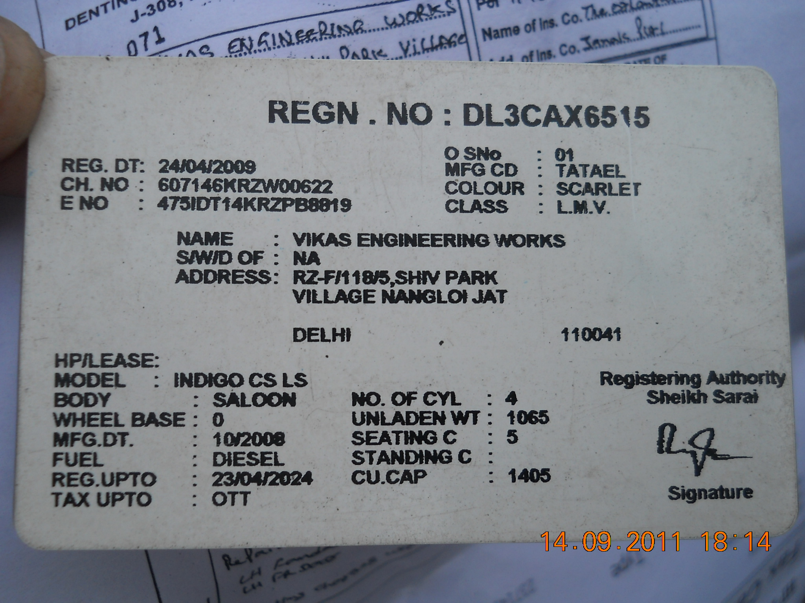
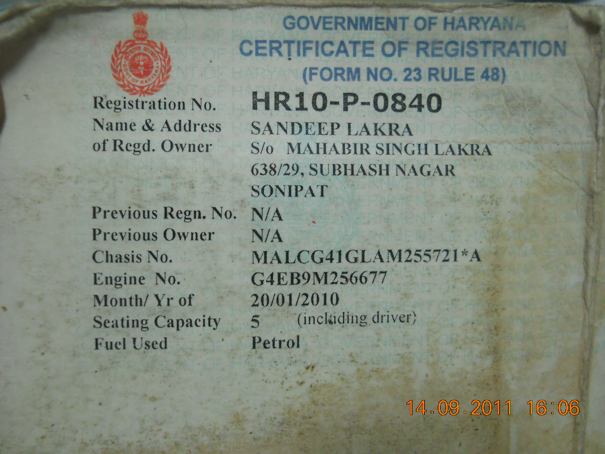
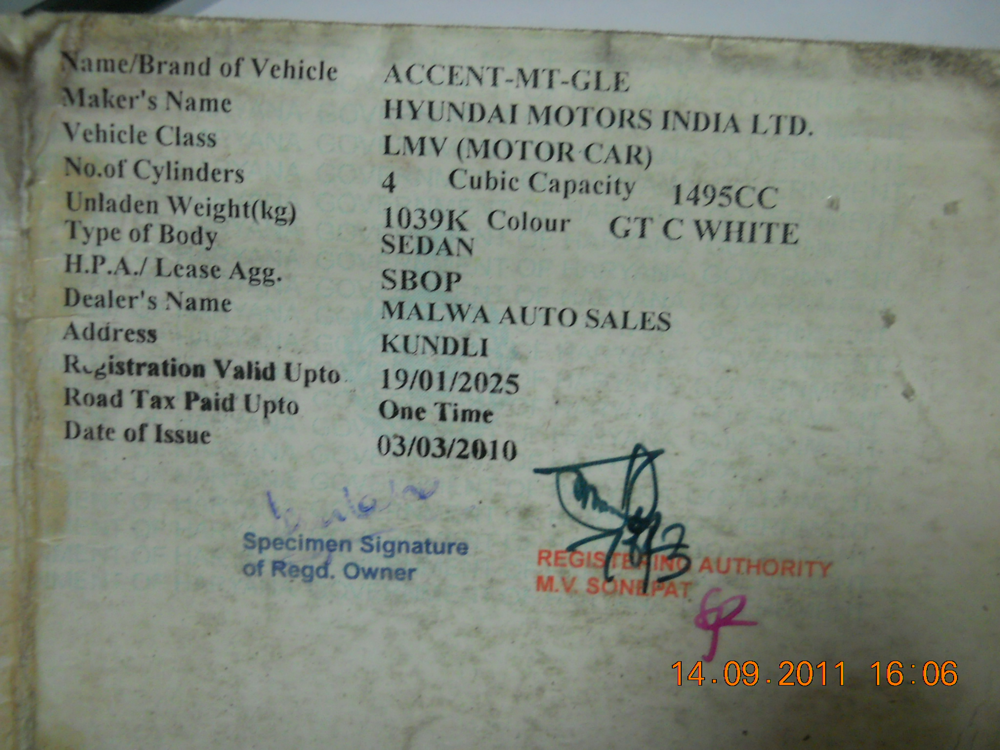
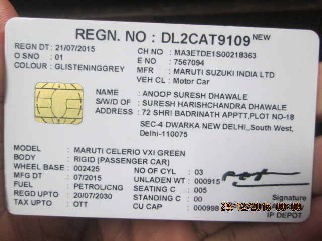
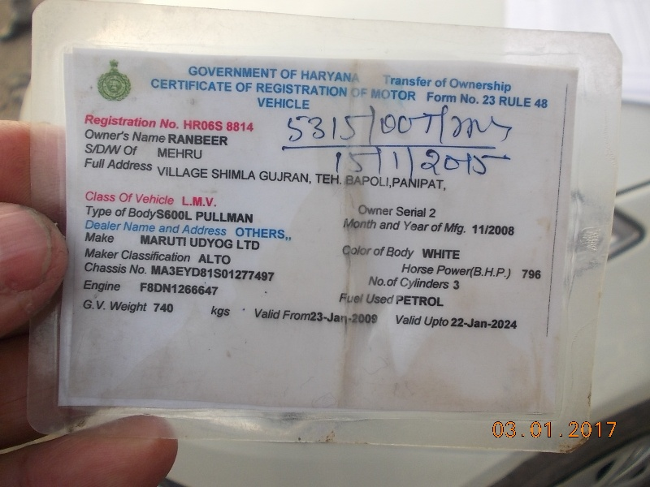
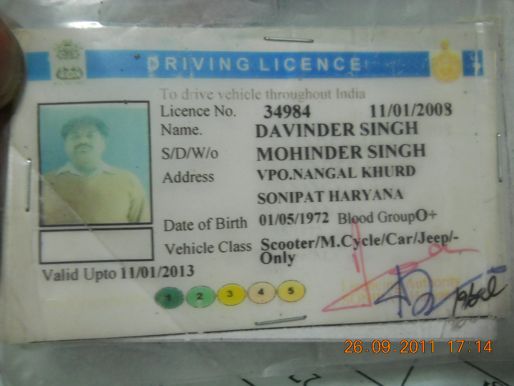
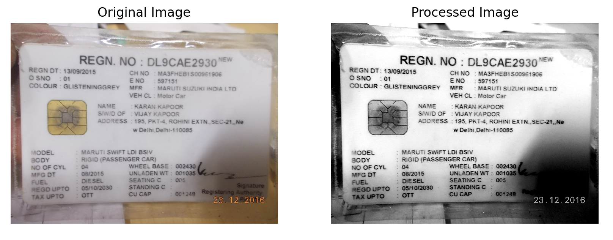
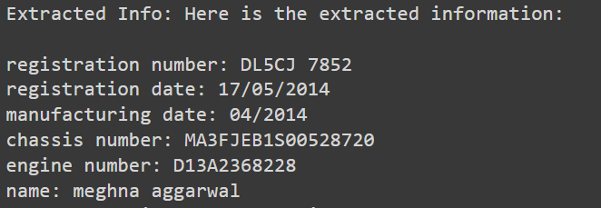
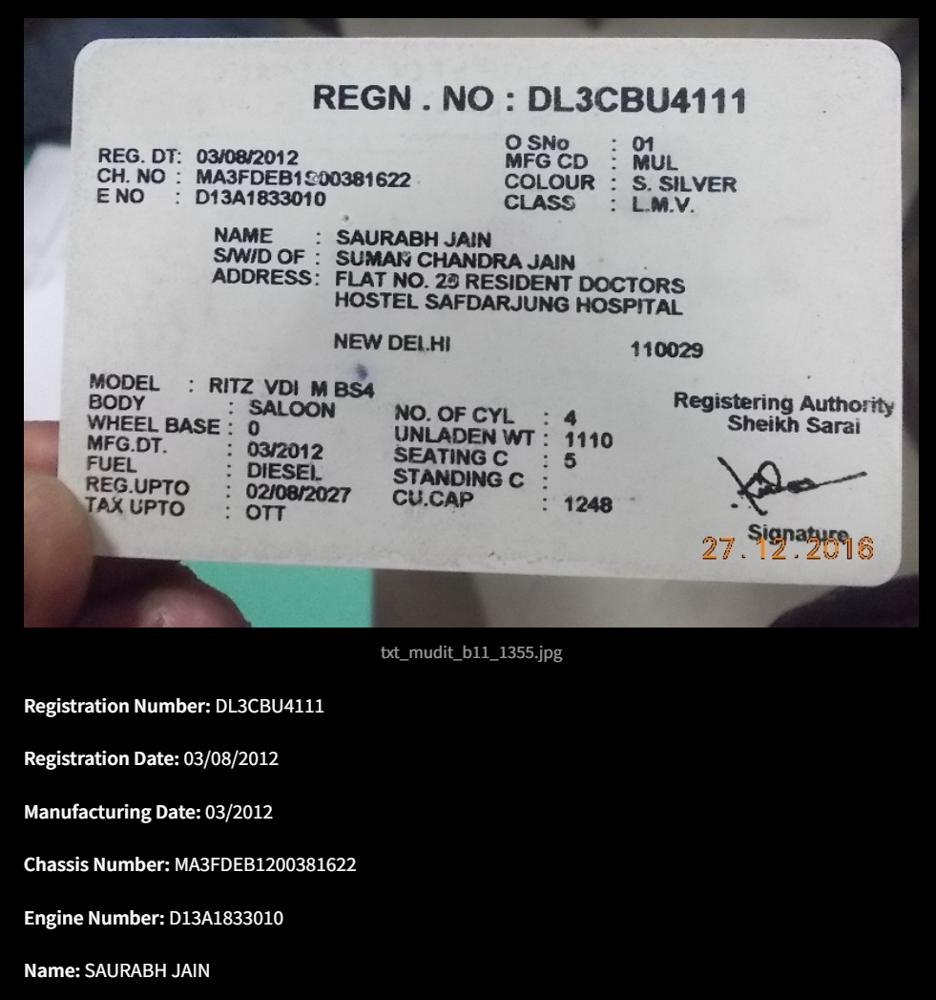

# Vehical Information Extraction and Information Parsing from Image

This project involves extracting and parsing important information from images by image preprocessing and using two OCR methods: Tesseract and EasyOCR. The extracted text from both methods is then processed using a large language model (LLM) to extract relevant details such as registration number, registration date, manufacturing date, chassis number, engine number, and name. The results are saved in a CSV file.

Python Colab Notebook : https://colab.research.google.com/drive/1INlE874qixhAh4k28UI5yZnD-ohHs0Rk?usp=sharing 

(Note: Create new folder called 'data' in colab files and upload all dataset images into it.)

## Table of Contents
- [Overview](#overview)
- [Understanding Dataset](#understanding-dataset)
- [Methodology](#methodology)
  - [Image Preprocessing](#image-preprocessing)
  - [Text Extraction](#text-extraction)
  - [Important Information Extraction](#important-information-extraction)
  - [CSV Generation](#csv-generation)
- [Installation and Setup](#installation-and-setup)
- [Output](#output)

## Overview

The project uses computer vision and natural language processing techniques to automate the extraction of key information from document images. The workflow involves:
1. Preprocessing images for better OCR results.
2. Extracting text using Tesseract and EasyOCR.
3. Parsing important information from the extracted text using a large language model.
4. Storing the results in a structured CSV file.
5. Rpresenting CSV data on streamlit web-interface

DFD Diagram:


## Understanding Dataset

Dataset containes images about vehical information such as registration date, manufacturing date, chassis number, engine number, name.

There are various formats available in dataset, some of these dont have all information above mentioned.

Examples:







## Methodology

### Image Preprocessing

Images are preprocessed to improve OCR accuracy. The preprocessing steps include:
1. Converting the image to grayscale.
2. Denoising the image using Non-Local Means Denoising.
3. Applying Gaussian Blur to smooth the image.
4. Using adaptive thresholding to create a binary image.
5. Finding and cropping the largest contour to focus on the document.
6. Enhancing the image contrast and sharpening the image.

```python
def preprocess_and_extract_text_tesseract(image_path):
    image = cv2.imread(image_path)

    gray_image = cv2.cvtColor(image, cv2.COLOR_BGR2GRAY)

    denoised_image = cv2.fastNlMeansDenoising(gray_image, None, 30, 7, 21)

    blurred_image = cv2.GaussianBlur(denoised_image, (5, 5), 0)

    thresholded_image = cv2.adaptiveThreshold(blurred_image, 255, cv2.ADAPTIVE_THRESH_GAUSSIAN_C, cv2.THRESH_BINARY, 11, 2)

    contours, _ = cv2.findContours(thresholded_image, cv2.RETR_EXTERNAL, cv2.CHAIN_APPROX_SIMPLE)
    contour = max(contours, key=cv2.contourArea)

    x, y, w, h = cv2.boundingRect(contour)
    cropped_image = gray_image[y:y+h, x:x+w]

    pil_image = Image.fromarray(cropped_image)

    enhancer = ImageEnhance.Contrast(pil_image)
    enhanced_image = enhancer.enhance(2)

    sharpened_image = enhanced_image.filter(ImageFilter.SHARPEN)

    sharpened_image_np = np.array(sharpened_image)

    kernel = np.ones((2, 2), np.uint8)
    morphed_image = cv2.morphologyEx(sharpened_image_np, cv2.MORPH_CLOSE, kernel)
    ...
```

Processed Image Example:


### Text Extraction

#### Tesseract OCR

The preprocessed image is processed using Tesseract OCR with custom configurations to extract the text.

```python
def preprocess_and_extract_text_tesseract(image_path):
    ...
    custom_config = r'--oem 3 --psm 6'
    tesseract_text = pytesseract.image_to_string(morphed_image, config=custom_config)
    return tesseract_text 
```

#### EasyOCR
EasyOCR is used as an alternative OCR method to extract text directly from the original images.

```python
def extract_text_easyocr(image_path):
    ...
    result = reader.readtext(image_path, detail=0)
    easyocr_text = "\n".join(result)
    return easyocr_text
```

### Important Information Extraction
The extracted text from Tesseract and EasyOCR is processed using a large language model (LLM) to extract key details. The model is instructed to parse specific fields such as registration number, registration date, manufacturing date, chassis number, engine number, and name, following a defined format. Used LLM is Llama-3-70b.

```python
def extract_important_info(easyocr_text, tesseract_text):
    ...
    response = llm.invoke(messages)
    extracted_info = response.content
    ...
    return info_dict
```

LLM output:



### CSV Generation
The final step involves generating a CSV file that contains the extracted text from both OCR methods and the parsed information.

```python
def create_csv_with_text_and_image_names(directory, csv_filename):
    ...
    desired_columns = ['file_name', 'tesseract_text', 'easyocr_text', 'registration number', 'registration date', 'manufacturing date', 'chassis number', 'engine number',  'name']

    df = df.loc[:, desired_columns]
    df.to_csv(csv_filename, index=False)
```

## Installation and Setup

All dependencies are listed in requirements.txt file, to install required python libraries run the below command: 

```bash
pip install -r requirements.txt
```

To get output.csv file with extracted important features, run app.py:

```bash
python app.py
```

To get interactive output on web interface, run Show.py using streamlit:

```bash
streamlit run Show.py
```

## Output
The output.csv file contains the following columns:
- file_name
- tesseract_text
- easyocr_text
- registration number
- registration date
- manufacturing date
- chassis number
- engine number
- name

### Streamlit web interface output:
You can find representation of Data and compare the extracted text and image here:

https://vehical-rc-info-extraction.streamlit.app/

Example output image:


